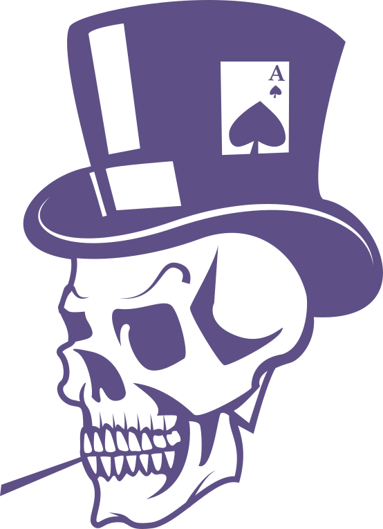

<div align="center">
  <a href="https://github.com/mmore21/darkedge" target="_blank">
</a>

  <h1>darkedge</h1>

  <p>
    <strong>Blackjack CLI for card counting training</strong>
  </p>

  <p>
    <a href="https://www.haskell.org/"></a>
    <a href="https://spdx.org/licenses/AGPL-3.0-only.html"></a>
  </p>
</div>

## Description

darkedge is a Blackjack CLI game with integrated card counting training.

## Installation

### Release

Download the latest release (TBD).

### Source

Alternatively, compile and run directly from source.

```sh
git clone https://github.com/mmore21/darkedge.git
cd darkedge/
```
```
$ cabal run
 _____
|A .  | _____
| /.\ ||A ^  | _____
|(_._)|| / \ ||A _  | _____
|  |  || \ / || ( ) ||A_ _ |
|____V||  .  ||(_'_)||( v )|
       |____V||  |  || \ / |
              |____V||  .  |
                     |____V|

[#] darkedge v0.0.1
~ Always account for variable change ~
...
```

## License

darkedge is available under the [GNU Affero General Public License v3.0](https://spdx.org/licenses/GPL-3.0-only.html).

## Resources

- [Programming Blackjack](https://brilliant.org/wiki/programming-blackjack/)


